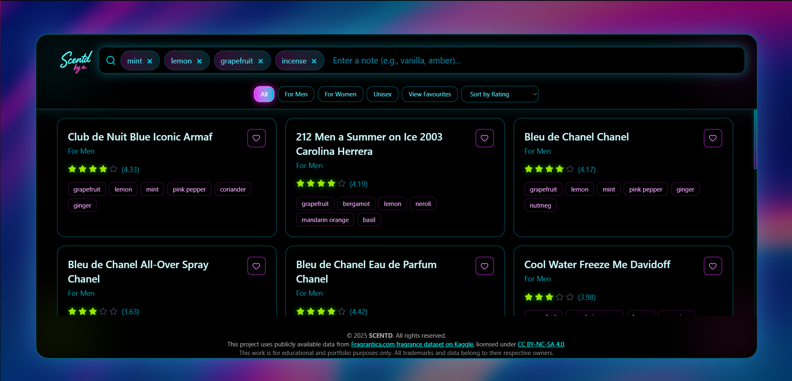

<<<<<<< HEAD
# 🌸 Fragrance Finder — Discover Your Perfect Scent Match

A **React web application** that helps users discover perfumes perfectly tailored to their personal taste.  
Instead of searching by just one note (like vanilla or oud), users can input *multiple notes they love* — and the app recommends fragrances that contain **all** of those notes.

---

## ✨ Demo
🧠 *“I like vanilla, oud, and raspberry.”*  
➡️ Fragrance Finder instantly shows perfumes that combine **all** these notes — not just one.  

---

## 🚀 Features
- 🧴 Enter **multiple fragrance notes** you enjoy  
- 🔍 Get **personalized perfume recommendations** that match all selected notes  
- ⚡ Fast and responsive **React frontend**  
- ☁️ **Firebase database** for storing perfume data  
- 🎨 Styled with **Tailwind CSS** for a clean, modern look  
- 🔁 Dynamic filtering logic using efficient JavaScript matching  

---

## 🛠️ Tech Stack
**Frontend:** React, Tailwind CSS  
**Backend / Database:** Firebase Firestore  
**Language:** JavaScript (ES6+)  
**Version Control:** Git & GitHub  

## 📸 App Preview

## 🧠 What I Learned
- Integrating Firebase Firestore with a React frontend
- Implementing dynamic search logic using multiple user inputs
- Structuring and styling scalable components with Tailwind CSS
- Managing real-time data retrieval and updates efficiently
- Designing a unique user experience in the fragrance niche

## 🔮 Future Improvements
- Add user profiles and saved searches 
- Add pictures to the perfume cards 
- Update the perfume dataset regularly with new releases 
- Add a search by note where you will see the most popular perfume for each note
- Add community reviews or scent ratings 
- Use AI to generate perfume recommendations 
- Optimize for mobile responsiveness

## 👤 Author
- Dev Ahmed Moussa

## 📧 ahmed-aboubakr@outlook.com

## 🌐 https://www.linkedin.com/in/ahmedaboubakr1

## 💻 https://github.com/DevAhmedMoussa
=======
# React + Vite

This template provides a minimal setup to get React working in Vite with HMR and some ESLint rules.

Currently, two official plugins are available:

- [@vitejs/plugin-react](https://github.com/vitejs/vite-plugin-react/blob/main/packages/plugin-react) uses [Babel](https://babeljs.io/) (or [oxc](https://oxc.rs) when used in [rolldown-vite](https://vite.dev/guide/rolldown)) for Fast Refresh
- [@vitejs/plugin-react-swc](https://github.com/vitejs/vite-plugin-react/blob/main/packages/plugin-react-swc) uses [SWC](https://swc.rs/) for Fast Refresh

## React Compiler

The React Compiler is not enabled on this template because of its impact on dev & build performances. To add it, see [this documentation](https://react.dev/learn/react-compiler/installation).

## Expanding the ESLint configuration

If you are developing a production application, we recommend using TypeScript with type-aware lint rules enabled. Check out the [TS template](https://github.com/vitejs/vite/tree/main/packages/create-vite/template-react-ts) for information on how to integrate TypeScript and [`typescript-eslint`](https://typescript-eslint.io) in your project.
>>>>>>> 8bd32c9 (Initial commit)
